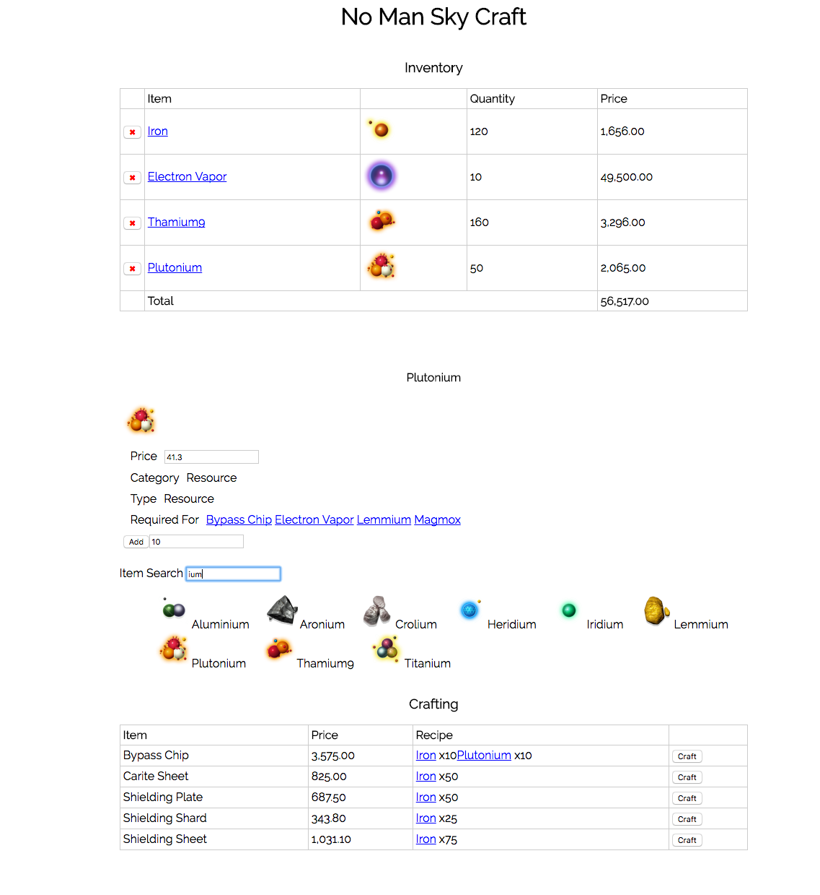

# No Man Sky Craft

A playground for experimenting with craftable items available in the game 'No
Man Sky'.

Features:

    - Inventory
    - Crafting from current inventory
    - Item information
    - Item search
    - Stores session between usage in localStorage
    - Single page app

To run:

```bash
git clone https://github.com/takac/nomanskycraft
cd nomanskycraft
npm install
bower install
gulp bower
tox -eflask
```

Then point your browser at http://127.0.0.1:5000/

There are two versions of the app, the original and the react-js rewrite. To
view the react version navigate to http://127.0.0.1:5000/react


